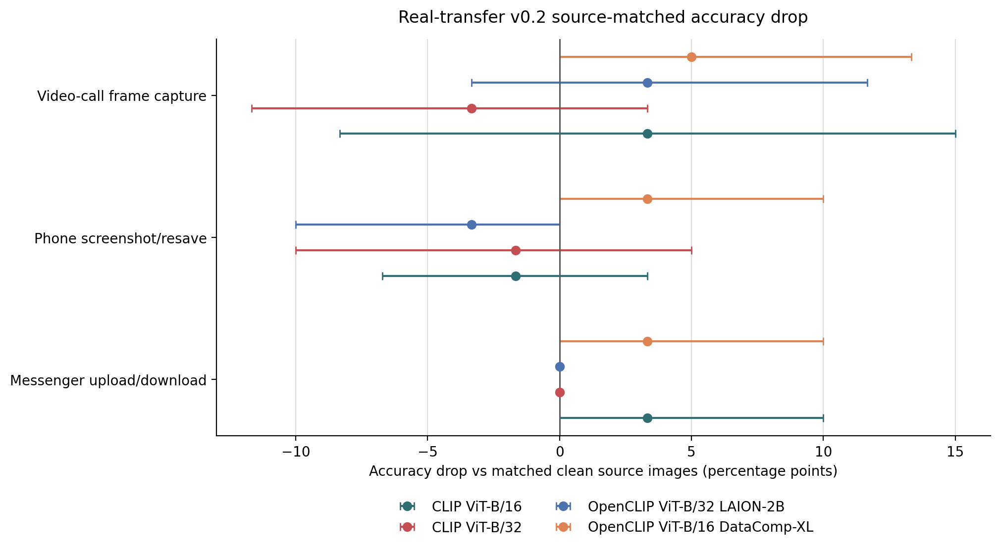
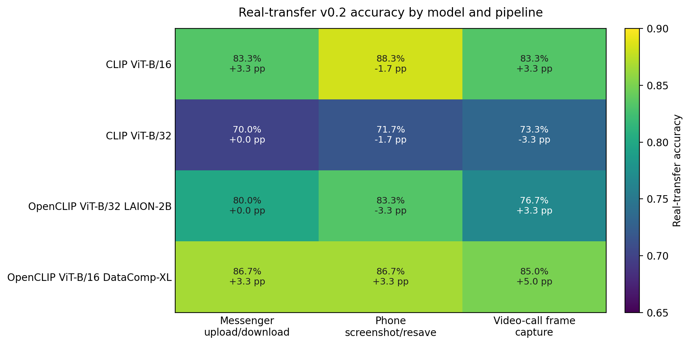

# Real-Transfer v0.2 Results

This report uses the source-matched real-transfer comparison: each model's real-transfer accuracy is compared against its clean accuracy on the 30 source images used to create the transferred outputs.

## Protocol Status

| Item | Value |
| --- | --- |
| Transferred outputs | 180 |
| Source images | 30 |
| Labels | 10 |
| Pipelines | 3 |
| Repeats per source/pipeline | 2 |
| Capture device | iPhone 15 Pro |
| Messenger pipeline | WhatsApp image upload/download |
| Screenshot pipeline | iPhone screenshot/resave |
| Video-call pipeline | FaceTime video-call/screen-share frame capture |

## Figures

## Model x Pipeline Results

| Model | Pipeline | Clean src. | Real acc. (95% CI) | Drop (95% CI) | Both repeats | Any repeat | Repeat agree |
| --- | --- | --- | --- | --- | --- | --- | --- |
| CLIP ViT-B/16 | Messenger upload/download | 86.7% | 83.3% [70.0%, 96.7%] | 3.3% [0.0%, 10.0%] | 83.3% | 83.3% | 100.0% |
| CLIP ViT-B/16 | Phone screenshot/resave | 86.7% | 88.3% [76.7%, 96.7%] | -1.7% [-6.7%, 3.3%] | 83.3% | 93.3% | 90.0% |
| CLIP ViT-B/16 | Video-call frame capture | 86.7% | 83.3% [71.7%, 93.3%] | 3.3% [-8.3%, 15.0%] | 76.7% | 90.0% | 83.3% |
| CLIP ViT-B/32 | Messenger upload/download | 70.0% | 70.0% [53.3%, 86.7%] | 0.0% [0.0%, 0.0%] | 70.0% | 70.0% | 100.0% |
| CLIP ViT-B/32 | Phone screenshot/resave | 70.0% | 71.7% [55.0%, 86.7%] | -1.7% [-10.0%, 5.0%] | 70.0% | 73.3% | 96.7% |
| CLIP ViT-B/32 | Video-call frame capture | 70.0% | 73.3% [56.7%, 88.3%] | -3.3% [-11.7%, 3.3%] | 70.0% | 76.7% | 86.7% |
| OpenCLIP ViT-B/32 LAION-2B | Messenger upload/download | 80.0% | 80.0% [63.3%, 93.3%] | 0.0% [0.0%, 0.0%] | 80.0% | 80.0% | 100.0% |
| OpenCLIP ViT-B/32 LAION-2B | Phone screenshot/resave | 80.0% | 83.3% [70.0%, 96.7%] | -3.3% [-10.0%, 0.0%] | 83.3% | 83.3% | 100.0% |
| OpenCLIP ViT-B/32 LAION-2B | Video-call frame capture | 80.0% | 76.7% [61.7%, 90.0%] | 3.3% [-3.3%, 11.7%] | 73.3% | 80.0% | 90.0% |
| OpenCLIP ViT-B/16 DataComp-XL | Messenger upload/download | 90.0% | 86.7% [73.3%, 96.7%] | 3.3% [0.0%, 10.0%] | 86.7% | 86.7% | 100.0% |
| OpenCLIP ViT-B/16 DataComp-XL | Phone screenshot/resave | 90.0% | 86.7% [73.3%, 96.7%] | 3.3% [0.0%, 10.0%] | 86.7% | 86.7% | 96.7% |
| OpenCLIP ViT-B/16 DataComp-XL | Video-call frame capture | 90.0% | 85.0% [71.7%, 96.7%] | 5.0% [0.0%, 13.3%] | 83.3% | 86.7% | 96.7% |

## Pipeline Consensus

| Pipeline | Mean real acc. | Mean drop | Min acc. | Max drop | Worst model |
| --- | --- | --- | --- | --- | --- |
| Video-call frame capture | 79.6% | 2.1% | 73.3% | 5.0% | OpenCLIP ViT-B/16 DataComp-XL |
| Messenger upload/download | 80.0% | 1.7% | 70.0% | 3.3% | CLIP ViT-B/16 |
| Phone screenshot/resave | 82.5% | -0.8% | 71.7% | 3.3% | OpenCLIP ViT-B/16 DataComp-XL |

## Open-Weight VLM Rows

The VLM prompt pack was also executed on Kaggle GPU for open-weight
assistant-style models over the same 30-clean/180-real-transfer prompt pack.
These rows are reported separately from the CLIP/OpenCLIP/prototype tables
because they use generated text answers and response parsing.

| Model | Clean src. | Real acc. | Drop | Unparseable | Abstention |
| --- | ---: | ---: | ---: | ---: | ---: |
| SmolVLM2-500M-Video-Instruct | 60.0% | 55.6% | 4.4% | 0.0% | 0.0% |
| InternVL3-1B-hf | 93.3% | 93.3% | 0.0% | 0.0% | 0.0% |

| Model | Pipeline | Real acc. (95% CI) | Drop (95% CI) |
| --- | --- | ---: | ---: |
| SmolVLM2-500M-Video-Instruct | Messenger upload/download | 63.3% [46.7%, 80.0%] | -3.3% [-10.0%, 0.0%] |
| SmolVLM2-500M-Video-Instruct | Phone screenshot/resave | 50.0% [33.3%, 66.7%] | 10.0% [-3.3%, 23.3%] |
| SmolVLM2-500M-Video-Instruct | Video-call frame capture | 53.3% [36.7%, 70.0%] | 6.7% [-6.7%, 20.0%] |
| InternVL3-1B-hf | Messenger upload/download | 93.3% [83.3%, 100.0%] | 0.0% [0.0%, 0.0%] |
| InternVL3-1B-hf | Phone screenshot/resave | 93.3% [83.3%, 100.0%] | 0.0% [0.0%, 0.0%] |
| InternVL3-1B-hf | Video-call frame capture | 93.3% [85.0%, 100.0%] | 0.0% [-5.0%, 5.0%] |

Artifacts are tracked in `reports/vlm_open_weight_smolvlm2_kaggle_v01/` and
`reports/vlm_open_weight_internvl3_1b_kaggle_v01/`.

## Weakest Label Rows

| Model | Label | Clean src. | Real acc. | Drop |
| --- | --- | --- | --- | --- |
| CLIP ViT-B/32 | canon_camera | 0.0% | 22.2% | -22.2% |
| CLIP ViT-B/32 | dymo_label_maker | 33.3% | 33.3% | 0.0% |
| CLIP ViT-B/32 | hair_brush | 33.3% | 33.3% | 0.0% |
| OpenCLIP ViT-B/32 LAION-2B | dymo_label_maker | 33.3% | 33.3% | 0.0% |
| OpenCLIP ViT-B/16 DataComp-XL | canon_camera | 33.3% | 33.3% | 0.0% |
| CLIP ViT-B/16 | dymo_label_maker | 66.7% | 55.6% | 11.1% |
| OpenCLIP ViT-B/32 LAION-2B | hair_brush | 66.7% | 55.6% | 11.1% |
| CLIP ViT-B/32 | lg_cell_phone | 66.7% | 61.1% | 5.6% |
| OpenCLIP ViT-B/16 DataComp-XL | hair_brush | 100.0% | 66.7% | 33.3% |
| CLIP ViT-B/16 | calcium_bottle | 66.7% | 66.7% | 0.0% |
| CLIP ViT-B/16 | canon_camera | 66.7% | 66.7% | 0.0% |
| CLIP ViT-B/16 | hair_brush | 66.7% | 66.7% | 0.0% |
| CLIP ViT-B/32 | calcium_bottle | 66.7% | 66.7% | 0.0% |
| OpenCLIP ViT-B/32 LAION-2B | calcium_bottle | 66.7% | 66.7% | 0.0% |
| OpenCLIP ViT-B/32 LAION-2B | lg_cell_phone | 66.7% | 66.7% | 0.0% |
| OpenCLIP ViT-B/16 DataComp-XL | calcium_bottle | 66.7% | 66.7% | 0.0% |

## Interpretation

- Real app/device transfer is now evaluated, not only scaffolded.
- Collector-supplied metadata identifies the capture device as iPhone 15 Pro, the messenger pipeline as WhatsApp, and the video-call/video-transmission pipeline as FaceTime.
- The observed drops are moderate rather than catastrophic, which is useful: the block acts as a realism guardrail for the larger simulated and native CURE-OR benchmark.
- Source-level bootstrap intervals are wide because the real-transfer block intentionally uses 30 source images; this supports cautious interpretation rather than overclaiming small pipeline differences.
- The strongest claim is model- and pipeline-dependent sensitivity, not a universal collapse under every real transfer pipeline.
- The open-weight VLM track now includes both a weak SmolVLM2 baseline and a much stronger InternVL3-1B row; this validates the prompt-pack/evaluator path and gives the paper a real model-family contrast without paid APIs.
- Per-file capture dates are not manually asserted here; they can be extracted from image metadata where present if needed for the final release.
