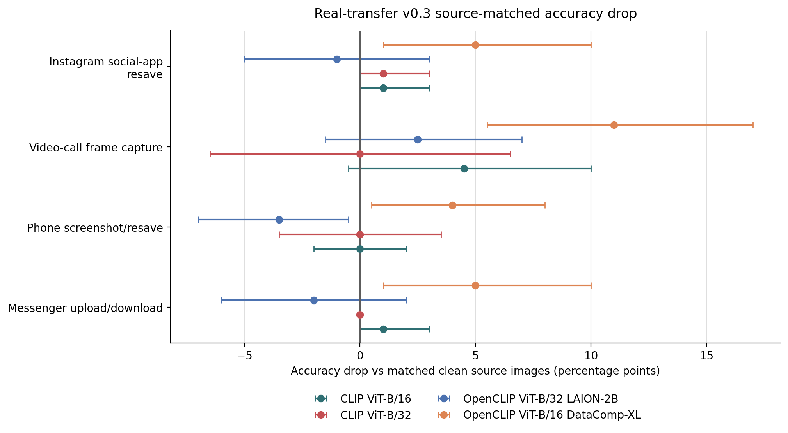
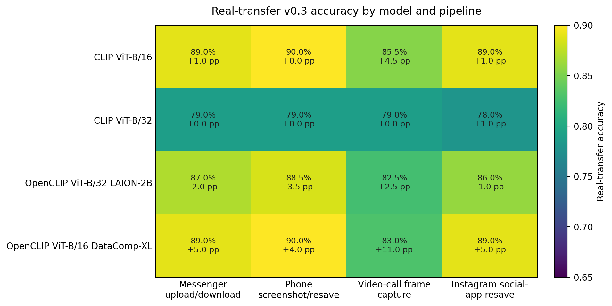

# Real-Transfer v0.3 Results

This report uses the full v0.3 source-matched real-transfer comparison: each model real-transfer accuracy is compared against clean accuracy on the 100 source images used to create 800 transferred outputs across four real app/device pipelines.

## Protocol Status

| Item | Value |
| --- | --- |
| Transferred outputs | 800 |
| Source images | 100 |
| Labels | 10 |
| Pipelines | 4 |
| Repeats per source/pipeline | 2 |
| Capture device | iPhone 15 Pro |
| Messenger upload/download pipeline | WhatsApp |
| Phone screenshot/resave pipeline | iPhone screenshot/resave |
| Video-call frame capture pipeline | FaceTime |
| Instagram social-app resave pipeline | Instagram |

## Figures

## Model x Pipeline Results

| Model | Pipeline | Clean src. | Real acc. (95% CI) | Drop (95% CI) | Both repeats | Any repeat | Repeat agree |
| --- | --- | --- | --- | --- | --- | --- | --- |
| CLIP ViT-B/16 | Messenger upload/download | 90.0% | 89.0% [83.0%, 94.0%] | 1.0% [0.0%, 3.0%] | 89.0% | 89.0% | 100.0% |
| CLIP ViT-B/16 | Phone screenshot/resave | 90.0% | 90.0% [84.0%, 95.0%] | 0.0% [-2.0%, 2.0%] | 88.0% | 92.0% | 96.0% |
| CLIP ViT-B/16 | Video-call frame capture | 90.0% | 85.5% [78.5%, 92.0%] | 4.5% [-0.5%, 10.0%] | 83.0% | 88.0% | 94.0% |
| CLIP ViT-B/16 | Instagram social-app resave | 90.0% | 89.0% [83.0%, 95.0%] | 1.0% [0.0%, 3.0%] | 89.0% | 89.0% | 100.0% |
| CLIP ViT-B/32 | Messenger upload/download | 79.0% | 79.0% [71.0%, 87.0%] | 0.0% [0.0%, 0.0%] | 79.0% | 79.0% | 100.0% |
| CLIP ViT-B/32 | Phone screenshot/resave | 79.0% | 79.0% [71.0%, 86.5%] | 0.0% [-3.5%, 3.5%] | 78.0% | 80.0% | 97.0% |
| CLIP ViT-B/32 | Video-call frame capture | 79.0% | 79.0% [71.0%, 86.5%] | 0.0% [-6.5%, 6.5%] | 78.0% | 80.0% | 95.0% |
| CLIP ViT-B/32 | Instagram social-app resave | 79.0% | 78.0% [69.0%, 86.0%] | 1.0% [0.0%, 3.0%] | 78.0% | 78.0% | 100.0% |
| OpenCLIP ViT-B/32 LAION-2B | Messenger upload/download | 85.0% | 87.0% [80.0%, 93.0%] | -2.0% [-6.0%, 2.0%] | 87.0% | 87.0% | 99.0% |
| OpenCLIP ViT-B/32 LAION-2B | Phone screenshot/resave | 85.0% | 88.5% [82.0%, 94.0%] | -3.5% [-7.0%, -0.5%] | 88.0% | 89.0% | 98.0% |
| OpenCLIP ViT-B/32 LAION-2B | Video-call frame capture | 85.0% | 82.5% [75.0%, 89.0%] | 2.5% [-1.5%, 7.0%] | 79.0% | 86.0% | 91.0% |
| OpenCLIP ViT-B/32 LAION-2B | Instagram social-app resave | 85.0% | 86.0% [79.0%, 93.0%] | -1.0% [-5.0%, 3.0%] | 86.0% | 86.0% | 100.0% |
| OpenCLIP ViT-B/16 DataComp-XL | Messenger upload/download | 94.0% | 89.0% [82.0%, 95.0%] | 5.0% [1.0%, 10.0%] | 89.0% | 89.0% | 100.0% |
| OpenCLIP ViT-B/16 DataComp-XL | Phone screenshot/resave | 94.0% | 90.0% [84.5%, 95.0%] | 4.0% [0.5%, 8.0%] | 87.0% | 93.0% | 93.0% |
| OpenCLIP ViT-B/16 DataComp-XL | Video-call frame capture | 94.0% | 83.0% [75.5%, 89.5%] | 11.0% [5.5%, 17.0%] | 81.0% | 85.0% | 96.0% |
| OpenCLIP ViT-B/16 DataComp-XL | Instagram social-app resave | 94.0% | 89.0% [83.0%, 95.0%] | 5.0% [1.0%, 10.0%] | 89.0% | 89.0% | 100.0% |

## Pipeline Consensus

| Pipeline | Mean real acc. | Mean drop | Min acc. | Max drop | Worst model |
| --- | --- | --- | --- | --- | --- |
| Video-call frame capture | 82.5% | 4.5% | 79.0% | 11.0% | OpenCLIP ViT-B/16 DataComp-XL |
| Instagram social-app resave | 85.5% | 1.5% | 78.0% | 5.0% | OpenCLIP ViT-B/16 DataComp-XL |
| Messenger upload/download | 86.0% | 1.0% | 79.0% | 5.0% | OpenCLIP ViT-B/16 DataComp-XL |
| Phone screenshot/resave | 86.9% | 0.1% | 79.0% | 4.0% | OpenCLIP ViT-B/16 DataComp-XL |

## Weakest Label Rows

| Model | Label | Clean src. | Real acc. | Drop |
| --- | --- | --- | --- | --- |
| CLIP ViT-B/32 | canon_camera | 30.0% | 25.0% | 5.0% |
| OpenCLIP ViT-B/32 LAION-2B | calcium_bottle | 40.0% | 41.2% | -1.2% |
| OpenCLIP ViT-B/16 DataComp-XL | canon_camera | 60.0% | 48.8% | 11.2% |
| CLIP ViT-B/32 | dymo_label_maker | 50.0% | 50.0% | 0.0% |
| CLIP ViT-B/16 | canon_camera | 60.0% | 52.5% | 7.5% |
| OpenCLIP ViT-B/16 DataComp-XL | calcium_bottle | 80.0% | 67.5% | 12.5% |
| CLIP ViT-B/32 | lg_cell_phone | 70.0% | 68.8% | 1.2% |
| CLIP ViT-B/16 | dymo_label_maker | 80.0% | 71.2% | 8.8% |
| OpenCLIP ViT-B/32 LAION-2B | dymo_label_maker | 80.0% | 72.5% | 7.5% |
| OpenCLIP ViT-B/32 LAION-2B | canon_camera | 70.0% | 73.8% | -3.8% |
| CLIP ViT-B/32 | hair_brush | 70.0% | 75.0% | -5.0% |
| CLIP ViT-B/32 | calcium_bottle | 80.0% | 78.8% | 1.3% |
| CLIP ViT-B/16 | calcium_bottle | 80.0% | 80.0% | 0.0% |
| OpenCLIP ViT-B/16 DataComp-XL | lg_cell_phone | 100.0% | 82.5% | 17.5% |
| OpenCLIP ViT-B/32 LAION-2B | lg_cell_phone | 70.0% | 86.2% | -16.3% |
| OpenCLIP ViT-B/32 LAION-2B | hair_brush | 90.0% | 87.5% | 2.5% |

## Interpretation

- Real app/device transfer is now evaluated, not only scaffolded.
- Collector-supplied metadata identifies the capture device as iPhone 15 Pro, the messenger pipeline as WhatsApp, the video-call/video-transmission pipeline as FaceTime, and the social-app resave pipeline as Instagram.
- The observed drops are moderate rather than catastrophic, which is useful: the block acts as a realism guardrail for the larger simulated and native CURE-OR benchmark.
- Source-level bootstrap intervals are source-matched over 100 source images; this supports cautious interpretation rather than overclaiming small pipeline differences.
- The strongest claim is model- and pipeline-dependent sensitivity, not a universal collapse under every real transfer pipeline.
- Per-file capture dates are not manually asserted here; they can be extracted from image metadata where present if needed for the final release.
